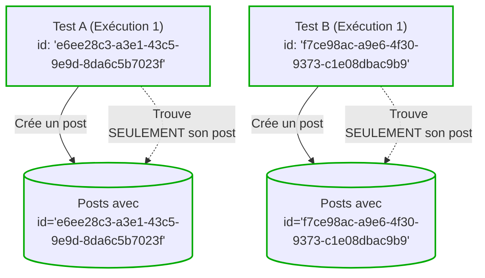
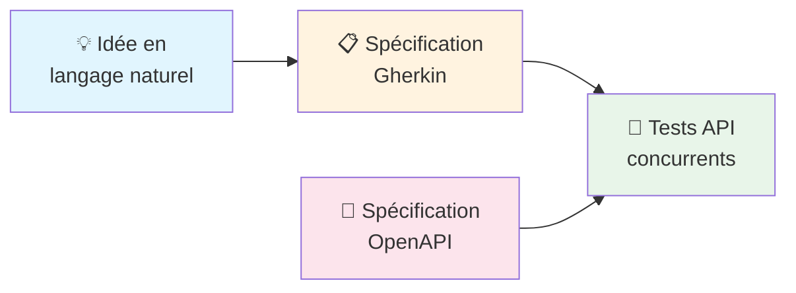

([Version anglaise](README.md))

# Concurrent API Tests

**Vos tests devraient vous aider, pas vous freiner.**

Le scénario est connu : les tests unitaires passent, les mocks sont au vert, et pourtant la production plante. Quant aux tests d'intégration — ceux qui détectent les vrais problèmes — ils sont si lents et capricieux que l'équipe finit par les éviter. Résultat : on teste moins, on livre plus de bugs.

**On peut faire autrement.**

Les tests API concurrents permettent de lancer des centaines de scénarios de bout en bout en quelques secondes. Le secret n'est pas la puissance brute, mais la conception : des tests isolés, sans état partagé, sans dépendances croisées, sans le fameux « ça fonctionne sur ma machine ».

## Pourquoi les équipes adoptent cette approche

Cette approche a été validée sur plusieurs projets avec de nombreux contributeurs, gérant **plus de 1500 tests API** qui s'exécutent de manière fiable à chaque commit.

### Bénéfices pour les équipes et la direction

- **Livrez en toute confiance.** Une vraie couverture d'intégration détecte les vrais bugs avant qu'ils n'atteignent les utilisateurs.
- **Une approche pérenne.** Plus les tests sont fiables et facile à écrire/maintenir, plus on en tire profit. Une couverture complète devient *viable* — pas un luxe qu'on repousse à « plus tard ».
- **S'adapte à toute taille d'équipe.** Des patterns simples que tout développeur peut rapidement adopter. Les nouveaux membres écrivent leur premier test dès le premier jour.

### Bénéfices pour les développeurs

- **Effectuez des changements sans crainte.** Vous testez contre l'API — le contrat le plus stable de votre système. Remplacez des librairies, restructurez l'interne, mettez à jour les dépendances. Si le comportement de l'API est préservé, vos tests restent au vert.
- **Comprenez le système en lisant les tests.** Quand vous découvrez une fonctionnalité inconnue, les tests vous montrent comment elle fonctionne réellement — pas comment quelqu'un espérait qu'elle fonctionne il y a six mois.
- **Restez dans le flow.** Lancez la suite complète en local en quelques secondes. Sachez en quelques secondes ou minutes — pas en heures — si votre changement a cassé quelque chose.

## Documentation

### [Guide des tests API concurrents](doc/concurrent-api-testing-guide.md)
**Prêt pour la production** — La méthodologie de base. Couvre le partitionnement des données, l'isolation des tests, les templates, les fixtures, et tout ce dont vous avez besoin pour écrire des tests concurrents fiables. [Lire le guide](doc/concurrent-api-testing-guide.md) pour commencer.

### [Écrire des tests avec des agents IA](doc/writing-concurrent-api-tests-with-ai-agents.md)
**Expérimental** — Un workflow incrémental utilisant des agents IA : langage naturel → spécifications Gherkin → tests concurrents. Résultats préliminaires prometteurs, pas encore validé à grande échelle. [En savoir plus](doc/writing-concurrent-api-tests-with-ai-agents.md)

## mocha-concurrent-api-tests

Mocha n'est plus recommandé pour implémenter les tests API concurrents. Voir l'[ADR](/adrs/adr-0001-replace-mocha-parallel-with-vitest.md) pour plus de détails.

## Licence et propriété intellectuelle

Le code source de ce projet est distribué sous licence [MIT](LICENSE).

## Contribuer

Voir [CONTRIBUTING.md](CONTRIBUTING.md#comment-contribuer)

## Code de Conduite

La participation à ce projet est encadrée par le [Code de Conduite](CODE_OF_CONDUCT.md#code-de-conduite).
