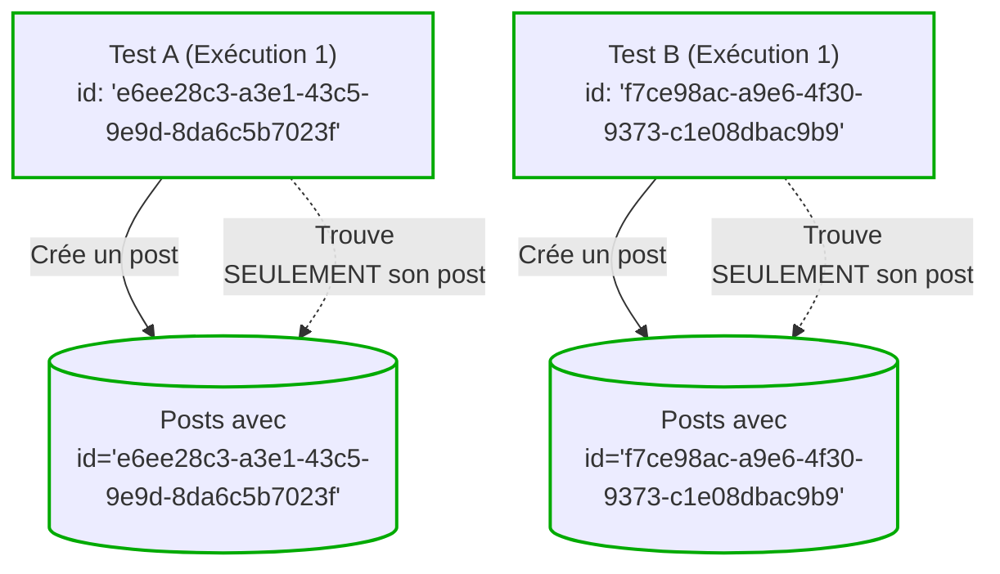
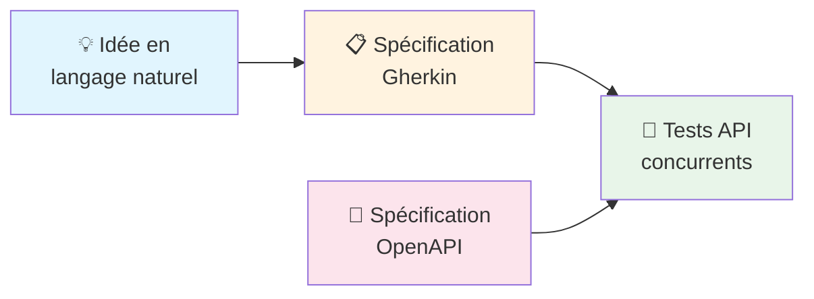

([Version anglaise](README.md))

# Concurrent API Tests

**Vos tests devraient vous aider, pas vous freiner.**

Le scénario est connu : les tests unitaires passent, les mocks sont au vert, et pourtant la production plante. Quant aux tests d'intégration — ceux qui détectent les vrais problèmes — ils sont si lents et capricieux que l'équipe finit par les éviter. Résultat : on teste moins, on livre plus de bugs.

**On peut faire autrement.**

Les tests API concurrents permettent de lancer des centaines de scénarios de bout en bout en quelques secondes. Le secret n'est pas la puissance brute, mais la conception : des tests isolés, sans état partagé, sans dépendances croisées, sans le fameux « chez moi ça marche ».

Cette approche a été éprouvée sur plusieurs projets avec de nombreux contributeurs, gérant **plus de 1500 tests API** qui s'exécutent de manière fiable à chaque commit.

## Ce que ça change concrètement

| | Avant | Après |
|---|-------|-------|
| **Confiance** | Tests verts, production cassée | Bugs détectés avant le merge |
| **Fiabilité** | Tests instables ignorés ou désactivés | Une suite sur laquelle on peut compter |
| **Rapidité** | « La suite complète ? On verra demain. » | Suite complète sur chaque PR |
| **Maintenance** | Fixtures partagées, échecs en cascade | Tests autonomes, faciles à comprendre |

## Au-delà de la vitesse

Oui, c'est rapide. Mais la rapidité n'est qu'un bénéfice secondaire.

La vraie valeur, c'est que **l'isolation rend les tests fiables**. Quand chaque test possède ses propres données, vous arrêtez de déboguer des échecs fantômes. Vous arrêtez de désactiver des tests « juste pour cette PR ». Vous arrêtez de traiter votre suite de tests comme un fardeau.

Les tests concurrents rendent une couverture complète viable au quotidien pas un luxe qu'on reporte à « plus tard ».

## Documentation

### [Guide des tests API concurrents](doc/concurrent-api-testing-guide.md)
**Prêt pour la production** — La méthodologie de base. Couvre le partitionnement des données, l'isolation des tests, les templates, les fixtures, et tout ce dont vous avez besoin pour écrire des tests concurrents fiables. [Lire le guide](doc/concurrent-api-testing-guide.md) pour commencer.

### [Écrire des tests avec des agents IA](doc/writing-concurrent-api-tests-with-ai-agents.md)
**Expérimental** — Un workflow incrémental utilisant des agents IA : langage naturel → spécifications Gherkin → tests concurrents. Résultats préliminaires prometteurs, pas encore validé à grande échelle. [En savoir plus](doc/writing-concurrent-api-tests-with-ai-agents.md)

## mocha-concurrent-api-tests

Mocha n'est plus recommandé pour implémenter les tests API concurrents. Voir l'[ADR](/adrs/adr-0001-replace-mocha-parallel-with-vitest.md) pour plus de détails.

## Licence et propriété intellectuelle

Le code source de ce projet est libéré sous la licence [MIT License](LICENSE).

## Contribuer

Voir [CONTRIBUTING.md](CONTRIBUTING.md#comment-contribuer)

## Code de Conduite

La participation à ce projet est réglementée par le [Code de Conduite](CODE_OF_CONDUCT.md#code-de-conduite)
