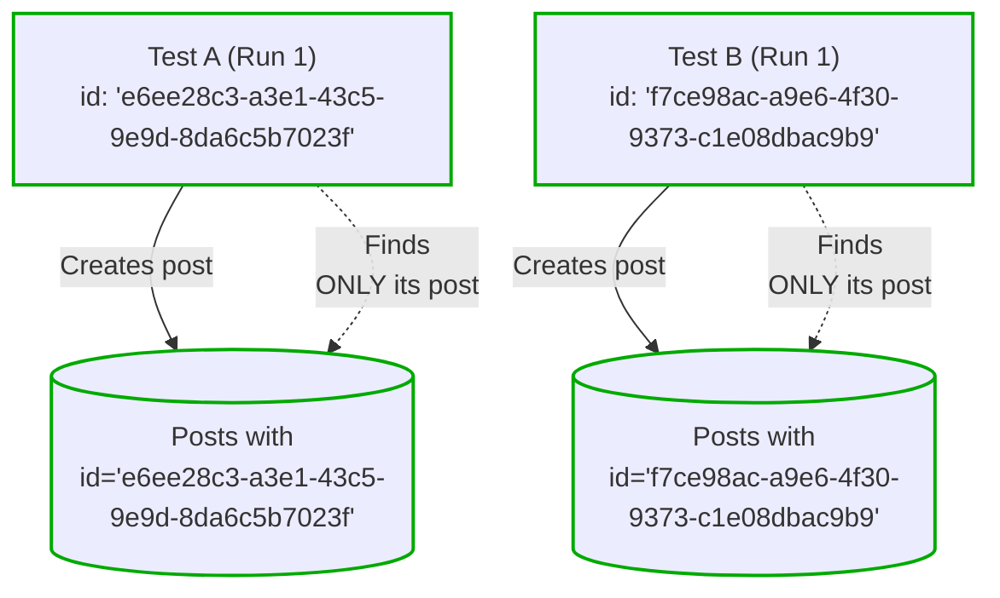
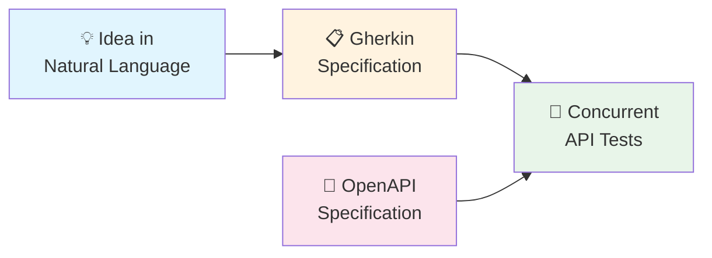

([French version](README-fr.md))

# Concurrent API Tests

**Your test suite shouldn't be the thing that slows you down.**

Most teams hit the same wall: unit tests pass, mocks are green, but production breaks anyway. The integration tests that actually catch real bugs? They're slow, flaky, and everyone's afraid to touch them. So you write fewer of them. And ship more bugs.

**There's a better way.**

Concurrent API testing lets you run hundreds of end-to-end tests in seconds—not by sacrificing thoroughness, but by designing tests that can safely run in parallel. No shared state. No flaky interdependencies. No "works on my machine."

## Why Teams Adopt This

This approach has been validated across multiple projects with many contributors, handling **1500+ API tests** that run reliably on every commit.

### Benefits for teams and leadership

- **Ship with confidence.** Real integration coverage catches real bugs before they reach users.
- **Sustainable quality.** The easier tests are to write and maintain, the more you invest in them—and the more you get back. Comprehensive coverage becomes *sustainable*—not a luxury you defer until "later."
- **Scales with your team.** Simple patterns that any developer can pick up quickly. New team members write their first test on day one. 

### Benefits for developers

- **Change without fear.** You're testing against the API—the most stable contract in your system. Swap out libraries, restructure internals, upgrade dependencies. If the API behavior is preserved, your tests stay green.
- **Understand the system by reading tests.** When you land on an unfamiliar feature, the tests show you how it actually works—not how someone hoped it would work six months ago.
- **Stay in flow.** Run the full suite locally. Know within seconds of minutes—not hours—if your change broke something.

## Documentation

### [Concurrent API Testing Guide](doc/concurrent-api-testing-guide.md)
**Production-ready** — The core methodology. Covers data partitioning, test isolation, templates, fixtures, and everything you need to write reliable concurrent tests. [Read the guide](doc/concurrent-api-testing-guide.md) to get started.

### [Writing Tests with AI Agents](doc/writing-concurrent-api-tests-with-ai-agents.md)
**Experimental** — An incremental workflow using AI agents: natural language → Gherkin specifications → concurrent tests. Promising early results, not yet validated at scale. [Read more on writing concurrent API tests with AI agents](doc/writing-concurrent-api-tests-with-ai-agents.md)

## mocha-concurrent-api-tests

Mocha is no longer recommended to implement Concurrent API Tests. See the [ADR](/adrs/adr-0001-replace-mocha-parallel-with-vitest.md) for more detail.

## License

The source code of this project is distributed under the [MIT License](LICENSE).

## Contributing

See [CONTRIBUTING.md](CONTRIBUTING.md).

## Code of Conduct

Participation in this project is governed by the [Code of Conduct](CODE_OF_CONDUCT.md).
