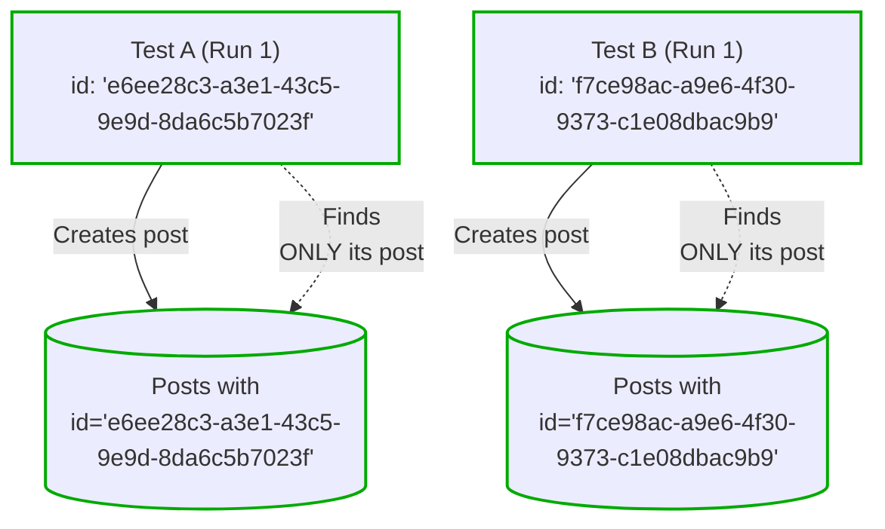
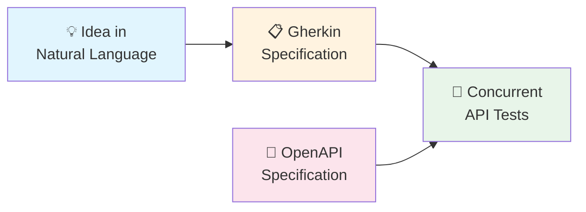

([French version](README-fr.md))

# Concurrent API Tests

**Your test suite shouldn't be the thing that slows you down.**

Most team hits the same wall: unit tests pass, mocks are green, but production breaks anyway. The integration tests that actually catch real bugs? They're slow, flaky, and everyone's afraid to touch them. So you write fewer of them. And ship more bugs.

**There's a better way.**

Concurrent API testing lets you run hundreds of end-to-end tests in seconds—not by sacrificing thoroughness, but by designing tests that can safely run in parallel. No shared state. No flaky interdependencies. No "works on my machine."

## Why Teams Adopt This

This approach has been validated across multiple projects with many contributors, handling **1500+ API tests** that run reliably on every commit.

## Value for teams and leadership

- **Ship with confidence.** Real integration coverage catches real bugs before they reach users.
- **Sustainable quality.** Tests that work reliably get written and maintained. Tests that don't get ignored and deleted. Concurrent testing makes comprehensive coverage *sustainable*—not a luxury you defer until "later."

## Value for developers
- Tests that are easy to read (and write)
- Blackbox testing against the most stable part of the system. It's API. Allows to test the systeme as a whole. Also allows for large refactoring and lib ugpgrade to become easy.
- Give context to understand the system as a whole. Reading the test is the place to start when you work on a feature you don't known.
- **Run the full suite locally.** Parallel execution means you don't wait. You stay in flow.
- **Faster feedback loops.** Developers know within minutes—not hours—if their change broke something.

## Documentation

### [Concurrent API Testing Guide](doc/concurrent-api-testing-guide.md)
**Production-ready** — The core methodology. Covers data partitioning, test isolation, templates, fixtures, and everything you need to write reliable concurrent tests. [Read the guide](doc/concurrent-api-testing-guide.md) to get started.

### [Writing Tests with AI Agents](doc/writing-concurrent-api-tests-with-ai-agents.md)
**Experimental** — An incremental workflow using AI agents: natural language → Gherkin specifications → concurrent tests. Promising early results, not yet validated at scale. [Read more on writing concurrent API tests with AI agents](doc/writing-concurrent-api-tests-with-ai-agents.md)

## mocha-concurrent-api-tests

Mocha is no longer recommended to implement Concurrent API Tests. See the [ADR](/adrs/adr-0001-replace-mocha-parallel-with-vitest.md) for more detail.

## License

The source code of this project is distributed under the [MIT License](LICENSE).

## Contributing

See [CONTRIBUTING.md](CONTRIBUTING.md).

## Code of Conduct

Participation in this poject is governed by the [Code of Conduct](CODE_OF_CONDUCT.md).
