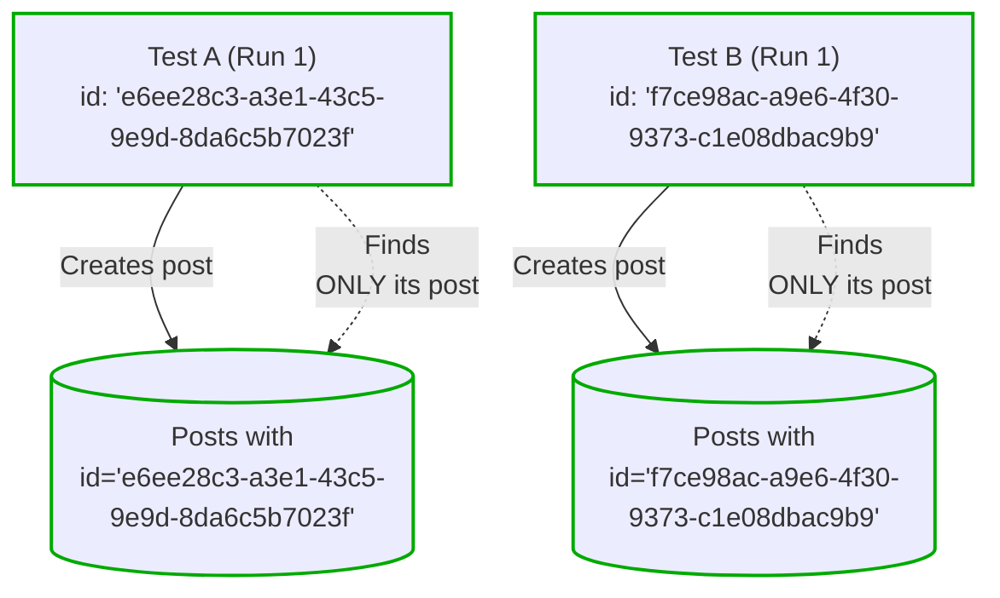
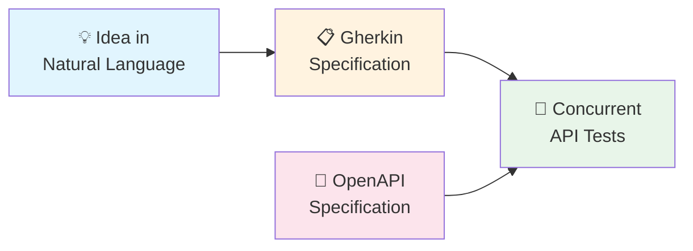

([French version](README-fr.md))

# Concurrent API Tests

Validating your system through the API layer provides the highest assurance that your application works for your users. By utilizing isolated, concurrent execution, you ensure that your test suite remains a reliable source of truth rather than a maintenance burden.

## Why This Approach?

| Benefit | Description |
|---------|-------------|
| **Higher Confidence** | All moving parts tested together through the real API |
| **Tests Stay Stable** | API contracts remain constant while internals evolve |
| **Easier to Write** | No complex mocking or shared setup/teardown |
| **Team Scale** | Tests stay reliable as your team and codebase grow |

## Moving Beyond Speed
While concurrent execution provides rapid feedback, its true value lies in practicality. It allows you to run comprehensive, end-to-end scenarios that would be too cumbersome to execute sequentially. This makes deep, thorough testing a sustainable part of your daily workflow rather than a luxury.

## Documentation

### [Concurrent API Testing Guide](doc/concurrent-api-testing-guide.md)
**Production-ready** — The core methodology. Covers data partitioning, test isolation, templates, fixtures, and everything you need to write reliable concurrent tests. Battle-tested across multiple projects with many contributors, handling 1500+ API tests. [Read the Concurrent API Testing Guide](doc/concurrent-api-testing-guide.md) and [start your project from the template](todo).

### [Writing Tests with AI Agents](doc/writing-concurrent-api-tests-with-ai-agents.md)
**Experimental** — An incremental workflow using AI agents: natural language → Gherkin specifications → concurrent tests. Promising early results, not yet validated at scale. [Read more on writing concurrent API tests with AI agents](doc/writing-concurrent-api-tests-with-ai-agents.md)

## mocha-concurrent-api-tests

Mocha is no longer recommended to implement Concurrent API Tests. See the [ADR](/adrs/adr-0001-replace-mocha-parallel-with-vitest.md) for more detail.

## License

The source code of this project is distributed under the [MIT License](LICENSE).

## Contributing

See [CONTRIBUTING.md](CONTRIBUTING.md).

## Code of Conduct

Participation in this poject is governed by the [Code of Conduct](CODE_OF_CONDUCT.md).
