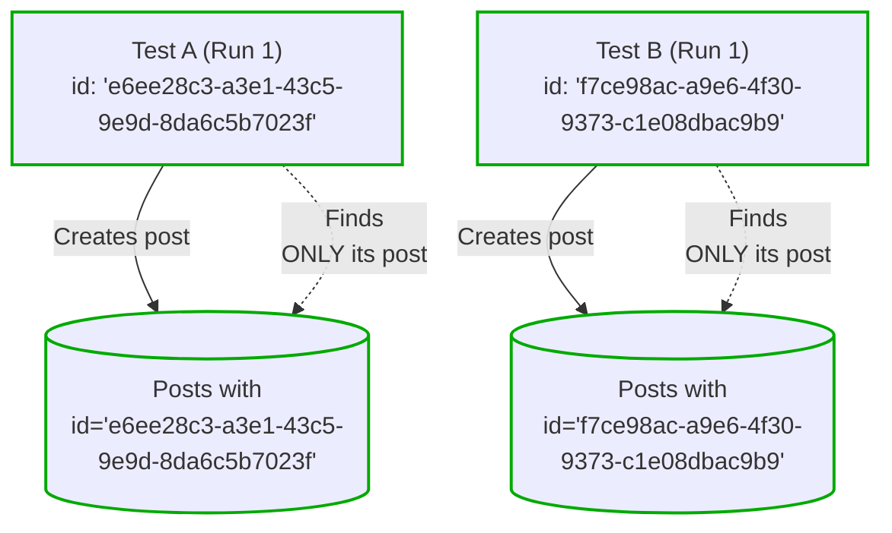
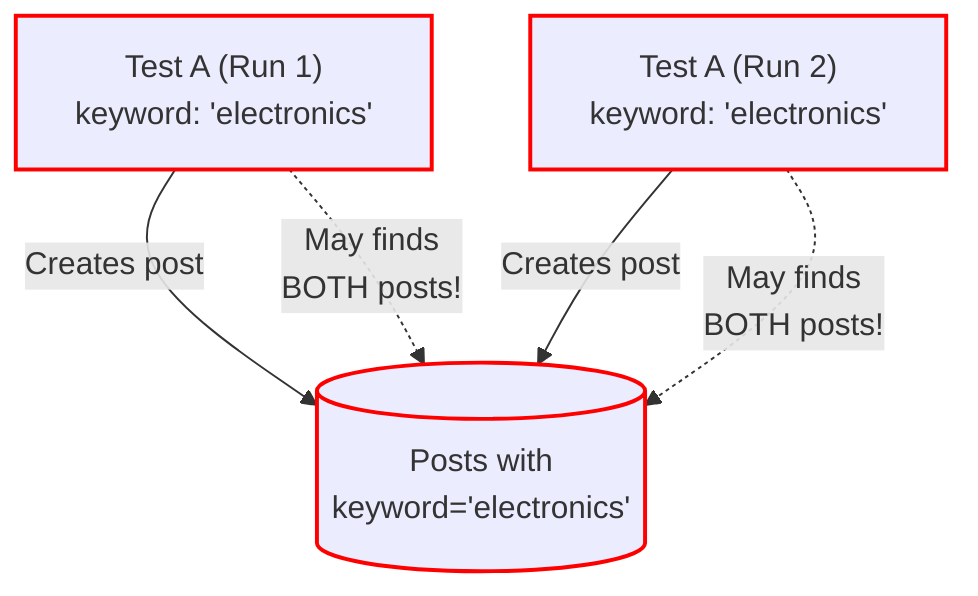
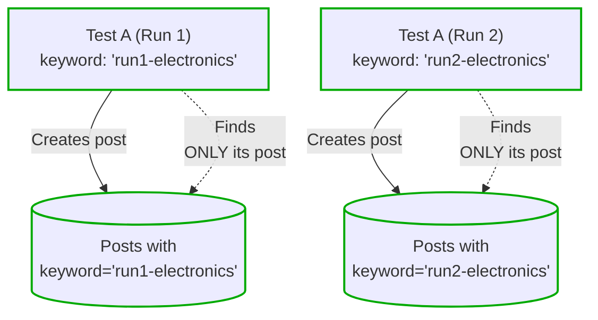
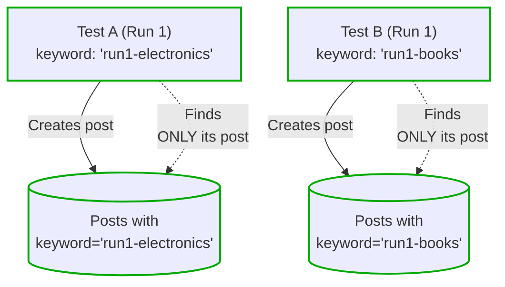
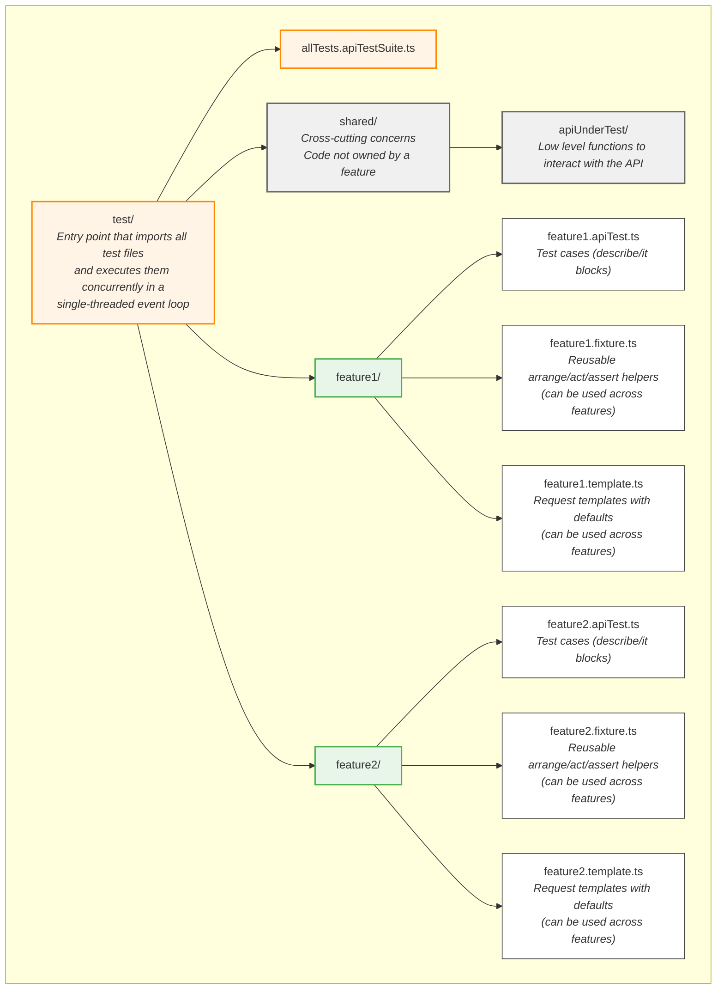

# Concurrent API Testing Guide

## Core Principles

### Black-Box Testing
Tests interact with the system **only through its public API**. No direct database queries, no internal service calls. This ensures your tests validate what users actually experience and remain valid even when internal implementations change.

### Full Isolation
Each test creates and operates on its own data. Tests never share mutable state and never depend on running in a specific order. This makes tests reliable and enables concurrent execution.

### Single-Threaded Event Loop
Tests execute using a single-threaded event loop architecture (via Vitest), not multithreading. Traditional frameworks like Mocha and Jest group tests around shared setup/teardown hooks, preventing true concurrent execution. A single-threaded event loop runs all tests simultaneously without grouping, enforcing isolation and maximizing speed. The test suite completes as fast as the slowest individual test.

---

## Data Partitioning: The Key to Concurrent Tests

### The Problem

Imagine two tests running simultaneously:
- Test A: "Search returns matching blog posts" — creates posts, then searches
- Test B: "Search returns matching blog posts" — creates posts, then searches

If both tests search the same database without isolation, Test A might find Test B's posts, causing unpredictable failures. Even worse, a test can interfere with its own previous run if old data persists.

### The Solution: Data Partitions

**Data partitions prevent interference between different test cases and between multiple executions of the same test.**

Each test operates in its own "partition" — a slice of data that no other test can see or affect. Think of it like each test working in its own sandbox where its toys can't mix with another test's toys.

You achieve isolation by ensuring each test's data has unique identifiers. When Test A searches for blog posts, it only finds the posts it created, not the ones from Test B. 

### How Partitioning Works

There are three scenarios, depending on the nature of the endpoint:

**1. Server-generated IDs** — Isolation happens automatically

When you create a resource and the server assigns the ID, each test naturally gets its own isolated data. The server returns a unique ID that only your test knows about.

```typescript
// Test A creates a post
const postA = await createBlogPost({ title: "Post A" });
// Server returns: { id: "abc123", title: "Post A" }

// Test B creates a post (running concurrently)
const postB = await createBlogPost({ title: "Post B" });
// Server returns: { id: "xyz789", title: "Post B" }

// Test A retrieves its post by ID — can't accidentally get Test B's post
const retrieved = await getBlogPost(postA.id); // Only gets "abc123"
```

**✅ With server-generated ID - Proper Isolation**

The server-generated ID of each blog post is unique (ex: sequential ID, GUID, etc.). Since they are unique, isolation between tests is guaranteed. Isolation between test runs is also guaranteed.



**2. Client-controlled fields** — You must make them unique

When you control a field that determines what data gets returned (like a category, keyword, or user email), you must make it unique per test. You must also use the `getTestRunId()` function to generate a prefix unique to each test run.

```typescript
// Test A searching by keyword
const keywordA = `${getTestRunId()}-electronics`;
await createBlogPost({ title: "Phone Review", keyword: keywordA });
const resultsA = await searchBlogPosts({ keyword: keywordA });
// Only finds posts with this exact keyword — Test B's posts are excluded

// Test B searching by keyword (running concurrently)
const keywordB = `${getTestRunId()}-books`;
await createBlogPost({ title: "Novel Review", keyword: keywordB });
const resultsB = await searchBlogPosts({ keyword: keywordB });
// Only finds posts with this exact keyword — Test A's posts are excluded
```

**❌ Without getTestRunId() - Data Collision**

Without the `getTestRunId()` prefix, Test A Run 1 and Run 2 both write to and read from the same keyword partition. When Test A Run 1 searches for "electronics", it finds posts from both its current run AND Run 2 (if Run 2 happened before). This causes unpredictable failures.



**✅ With getTestRunId() - Proper Isolation**


**✅ With unique identifier for each test - Proper Isolation**

When using client-controlled fields as data partition, you must also make sure each test's use a unique partition. When Test A searches for blog posts, it only finds the posts it created, not the ones from Test B. 



**3. Stateless endpoints** — No partition needed

Some endpoints don't read or write any persistent state. They simply transform input into output without side effects. Examples include:
- Calculator endpoints (`POST /calculate`)
- Data transformation or formatting endpoints
- Validation endpoints
- Health check endpoints

For these endpoints, tests can run concurrently without any isolation concerns because there's no shared state to interfere with.

```typescript
// Test A calculates a sum
const resultA = await calculate({ operation: "add", a: 5, b: 3 });
// Returns: { result: 8 }

// Test B calculates a product (running concurrently)
const resultB = await calculate({ operation: "multiply", a: 4, b: 7 });
// Returns: { result: 28 }

// No interference possible — each request is independent
```

### Designing Systems for Testability

Concurrent API testing requires the system to be built with testability in mind. When designing each API endpoint, you must consider how data will be partitioned. Most of the time, there's a natural data partition (like a server-generated ID), but sometimes you need to add one explicitly to the system.

Consider these options when a feature doesn't naturally partition:

1. **Less precise assertions** — Test the behavior without exact values (e.g., verify count increases rather than equals a specific number)
2. **Add a partition field with business value** — Design the API to filter by a field that makes sense (e.g., `GET /blog-posts/count?keyword=`)
3. **Artificial partition field** — Add an explicit partition parameter with no business value beyond testability (e.g., `GET /blog-posts/count?dataPartition=`). This feature ships to production but serves only testing needs. **Use only as a last resort.**

While adding features solely for testing isn't ideal, **it's acceptable to make tradeoffs for testability**. The evolution, reliability, and maintainability of your system depend largely on its testability.

### Documenting Data Partitions

**The key is knowing which fields control what data gets returned by your API.** Document the data partition strategy for each endpoint in a `data-partitions.yaml` file. This communicates to the team which partition field should be used for each endpoint and ensures consistent isolation across all tests.

#### The data-partitions.yaml File

Create this file alongside your OpenAPI spec (e.g., in `test/shared/apiUnderTest/`). It serves as the single source of truth for how each endpoint achieves test isolation.

**Structure:**

```yaml
# Data Partition Strategy
#
# Partition Types:
#   - server-generated: The server creates a unique identifier (automatic isolation)
#   - client-controlled: The test must provide a unique value (use getTestRunId() prefix)
#   - stateless: The endpoint doesn't read or write any persistent state (no partition needed)

dataPartitions:
  POST /blog-posts:
    type: server-generated
    field: id
    location: response.body

  GET /blog-posts:
    type: client-controlled
    field: keyword
    location: query

  GET /blog-posts/{id}:
    type: server-generated
    field: id
    location: path

  POST /calculate:
    type: stateless
```

**Fields explained:**

| Field | Description |
|-------|-------------|
| `type` | Either `server-generated` (automatic isolation), `client-controlled` (you must ensure uniqueness), or `stateless` (no partition needed) |
| `field` | The name of the field used for partitioning (not applicable for stateless) |
| `location` | Where the field exists: `response.body`, `query`, `path`, or `request.body` (not applicable for stateless) |

#### How to Use It

**Before writing a test**, look up the endpoint in `data-partitions.yaml`:

1. **If `type: server-generated`** — No special action needed. The server returns a unique ID; use it for subsequent operations.

2. **If `type: client-controlled`** — Use `getTestRunId()` as a prefix for the partition field value:

```typescript
// data-partitions.yaml says: field: keyword, type: client-controlled
// Use getTestRunId() prefix with a meaningful suffix:
const keyword = `${getTestRunId()}-electronics-search`;
```

3. **If `type: stateless`** — No data partitioning needed. The endpoint doesn't read or write any persistent state (e.g., calculator, transformation, validation endpoints). Tests can run concurrently without any isolation concerns.

#### Why This Matters

- **Onboarding**: New team members instantly know how to isolate their tests
- **Consistency**: Everyone uses the same partitioning strategy for each endpoint
- **Code reviews**: Reviewers can verify tests follow the documented strategy
- **Prevents bugs**: No more guessing which field to use for isolation

### Practical Consequence: Teardown Is Optionnal
Because each test operates on isolated data with unique identifiers, cleanup during test execution is unnecessary. Tests don't interfere with each other, so there's no need to delete what was created.

This simplifies test code significantly — no `afterEach` hooks, no complex cleanup logic, and no risk of teardown failures affecting other tests.

**Teardown Strategies**

**Best approach**: Reset the database to zero when storage runs low or when you want a completely clean state. Since tests never depend on pre-existing state, you can always start fresh. This is the simplest and most reliable approach.

**Alternative approach**: If a full database reset isn't feasible, ensure all test-generated data is distinguishable from production data (using `getTestRunId()` prefixes or dedicated test schemas). Write a global cleanup script that runs periodically to purge all test data, separate from test execution.

---

## Writing Tests: Arrange-Act-Assert

Every test follows three phases, separated by blank lines for readability:

```typescript
it("Create blog post with custom title", async () => {
  // ARRANGE: Set up the data needed for the test
  const request = copyBlogPostTemplate((x) => {
    x.title = "My Custom Title";
  });

  // ACT: Perform the action being tested
  const actual = await postBlogPost(request);

  // ASSERT: Verify the result
  assert.strictEqual(actual.title, "My Custom Title");
});
```

### Testing Error Cases

When you expect an error, use `shouldThrow()` to catch and verify it:

```typescript
it("Title is required", async () => {
  const request = copyBlogPostTemplate((x) => {
    x.title = null;
  });

  await shouldThrow(
    () => postBlogPost(request),
    (err) => {
      assert.strictEqual(err.status, 400);
      assert.include(err.message, "title");
    }
  );
});
```

## Templates: Reducing Noise in Tests

### The Problem

API requests often have many required fields. If every test specifies every field, the important details get buried:

```typescript
// ❌ Too much noise — what is this test actually checking?
const request = {
  title: "Test Post",
  content: "Some content here",
  keywords: ["test"],
  publishDate: "2024-01-01",
  category: "tech",
  referenceLinks: [],
  // ... 10 more fields
};
```

### The Solution: Templates with Defaults

Define a template once with valid default values. Tests override only the fields that matter for what they're verifying:

```typescript
// Define once in *.template.ts
export const copyBlogPostTemplate = defineCopyTemplate<BlogPost>({
  title: "titleDefault",
  content: "contentDefault",
  keywords: [],
  category: "categoryDefault",
  referenceLinks: [],
  // ... all fields with recognizable defaults
});

// In test — crystal clear what we're testing
const request = copyBlogPostTemplate((x) => {
  x.title = ""; // Testing empty title validation
});
```

### Nesting Templates

Templates can be nested when your request contains complex objects. Define a separate template for each nested type:

```typescript
// Define template for nested object
export const copyReferenceLinkTemplate = defineCopyTemplate<ReferenceLink>({
  title: "titleDefault",
  description: "descriptionDefault",
  href: "https://www.href-default.com",
});

// Use nested templates in tests
const request = copyBlogPostTemplate((x) => {
  x.title = "A post with 2 reference links";
  x.referenceLinks = [
    copyReferenceLinkTemplate((y) => {
      y.href = "https://www.google.com";
    }),
    copyReferenceLinkTemplate((y) => {
      y.href = "https://montreal.ca";
    }),
  ];
});
```

This approach keeps tests readable even when working with deeply nested data structures. Each template focuses on its own type and provides sensible defaults for all fields.

### The Minimalistic Principle

**Override only what's meaningful for the behavior under test.** If you're testing that empty titles are rejected, only set the title. Leave everything else at defaults. This makes tests self-documenting: the overridden fields tell readers exactly what's being tested.

## Assertions: What to Check

### The Minimalistic Principle (Again)

**Assert only what proves the behavior works.** If you're testing that a post is created with a specific title, assert the title. Don't assert the creation date, the default category, or other fields — they're not what you're testing.

```typescript
// ❌ Over-asserting — too many irrelevant checks
it("Create blog post with custom title", async () => {
  const request = copyBlogPostTemplate((x) => {
    x.title = "My Custom Title";
  });

  const actual = await postBlogPost(request);

  assert.strictEqual(actual.title, "My Custom Title"); 
  assert.strictEqual(actual.category, "categoryDefault"); // Not testing this
  assert.strictEqual(actual.content, "contentDefault"); // Not testing this
  assert.ok(actual.createdDate); // Not testing this
  assert.ok(actual.id); // Not testing this
  assert.isArray(actual.referenceLinks); // Not testing this
});

// ✅ Minimal assertions — only what matters
it("Create blog post with custom title", async () => {
  const request = copyBlogPostTemplate((x) => {
    x.title = "My Custom Title";
  });

  const actual = await postBlogPost(request);

  assert.strictEqual(actual.title, "My Custom Title");
});
```

The minimal version is clearer, faster to write, and more maintainable. If unrelated fields break, the test shouldn't fail—that's what other tests are for.

### Don't assert on template defaults

Always override fields to meaningful values before asserting on them. This makes tests explicit, prevents failures when defaults change, and makes debugging easier:

```typescript
// ❌ Anti-pattern — asserting on default template values
it("Create blog post with title", async () => {
  const request = copyBlogPostTemplate(); // Uses titleDefault

  const actual = await postBlogPost(request);

  assert.strictEqual(actual.title, "titleDefault"); // Brittle, unclear intent
});

// ✅ Correct — explicit meaningful value
it("Create blog post with title", async () => {
  const request = copyBlogPostTemplate((x) => {
    x.title = "A meaningful title"; // Clear what we're testing
  });

  const actual = await postBlogPost(request);

  assert.strictEqual(actual.title, "A meaningful title"); // Clear expectation
});
```

### Use Explicit Expected Values

**The rule**: When asserting on data you control, use literal values. When asserting on data the server generates, use variables.

**Why it matters**: Assertions with literal values are easier and faster to read. The reader can understand what's expected immediately, without looking back at the arrange section to figure out what the variable contains:

```typescript
// ❌ Harder to read — requires mental lookup and inference
it("Create multiple blog posts", async () => {
  const post1 = copyBlogPostTemplate((x) => {
    x.title = "JavaScript Fundamentals";
    x.category = "programming";
  });
  const post2 = copyBlogPostTemplate((x) => {
    x.title = "Web Performance Tips";
    x.category = "optimization";
  });

  const actual1 = await postBlogPost(post1);
  const actual2 = await postBlogPost(post2);

  // Reader must: look up post1, find its title property, remember "JavaScript Fundamentals"
  assert.strictEqual(actual1.title, post1.title);
  // Reader must: look up post1, find its category property, remember "programming"
  assert.strictEqual(actual1.category, post1.category);
  // Repeat for post2...
  assert.strictEqual(actual2.title, post2.title);
  assert.strictEqual(actual2.category, post2.category);
});

// ✅ Easier to read — expectation is immediately clear
it("Create multiple blog posts", async () => {
  const post1 = copyBlogPostTemplate((x) => {
    x.title = "JavaScript Fundamentals";
    x.category = "programming";
  });
  const post2 = copyBlogPostTemplate((x) => {
    x.title = "Web Performance Tips";
    x.category = "optimization";
  });

  const actual1 = await postBlogPost(post1);
  const actual2 = await postBlogPost(post2);

  // Reader sees exactly what's expected, no mental lookup required
  assert.strictEqual(actual1.title, "JavaScript Fundamentals");
  assert.strictEqual(actual1.category, "programming");
  assert.strictEqual(actual2.title, "Web Performance Tips");
  assert.strictEqual(actual2.category, "optimization");
});
```

**Exception for server-generated values**: When the server generates a value (IDs, timestamps, computed fields), you can't know it in advance. Compare against the variable from the response:

```typescript
// ✅ Correct — server generates the ID
const created = await postBlogPost(request);
const fetched = await getBlogPost(created.id);
assert.strictEqual(fetched.id, created.id);
```

### Don't Over-Assert

| Do | Don't |
|----|-------|
| Assert behavior-relevant attributes | Assert every returned field |
| Assert status + message on errors | Assert status code on success (2xx) |
| Let OpenAPI validate types | Manually check types are correct |


## Fixtures: Reusable Test Helpers

When multiple tests need the same arrange, act or assert functions, extract it to a fixture file. This keeps tests focused and reduces duplication.

### Example 1 - Validation error assertion with type safety

A common pattern is asserting that an API returns a validation error (HTTP 400). Without a fixture, you repeat the same checks and lose type safety:

```typescript
// ❌ Without fixture — repetitive, no type safety
await shouldThrow(
  () => postBlogPost(request),
  (err) => {
    assert.strictEqual(err.status, 400);
    assert.include(err.message, "title");
  }
);
```

Extract this to a shared fixture that validates the error structure and returns a typed object:

```typescript
// test/shared/validation.fixture.ts
export function assertValidationError(err: any): ApiErrorResponse {
  // Verify this is indeed a validation error
  assert.strictEqual(err.status, 400);
  assert.exists(err.data);

  // Explicit type cast to benefit from type safety afterward
  return err.data as ApiErrorResponse;
}
```

Now tests are cleaner and benefit from type safety after the assertion:

```typescript
// ✅ With fixture — cleaner, type-safe
await shouldThrow(
  () => postBlogPost(request),
  (err) => {
    const validationError = assertValidationError(err);
    // Type safety: validationError is ApiErrorResponse
    assert.include(validationError.message, "title");
  }
);
```

**Why this belongs in `test/shared/`**: Validation error handling is a cross-cutting concern used across all features, not specific to any single feature.

### Example 2 - Managing JWT token for many fake users

```typescript
// blogPost.fixture.ts
export async function postBlogPost(
  request: BlogPost,
  role: UserRole = "admin" // Each fixture sets its own default role
) {
  const jwtToken = await getJwtTokenForFakeUser(role);
  const response = await api.postBlogPost(request, { jwtToken });
  return response.body; // Return body directly to improve readability
}

// Used in tests
it("Editor can create blog post", async () => {
  const request = copyBlogPostTemplate();

  const actual = await postBlogPost(request, "editor");
});
```

**Best practice**: The API client returns the full HTTP response, but fixtures should return only the body. This improves readability by avoiding `actual.body.*` throughout your tests. For the rare cases where you need HTTP headers, status codes, or other response metadata, create a separate fixture function that returns the full response.

### Shared Immutable Fixtures

When multiple tests need the same read-only data, create it once and share it. This is common for authentication tokens or reference data that doesn't change:

```typescript
// blogPost.fixture.ts

// Shared by key — caches one JWT token per role
export const getJwtTokenFor = defineGetSharedFixtureByKey<UserRole, JwtToken>(
  (role) => fetchJwtToken(role)  // Pseudo: authenticate with backend, return token
);

// For simpler cases without a key, use:
// export const getJwtToken = defineGetSharedFixture<JwtToken>(
//   () => fetchJwtToken("admin")
// );
```

**How it works**: The first test that calls `getJwtTokenFor("editor")` triggers the actual authentication. Subsequent tests reuse the cached token. This dramatically reduces authentication overhead—instead of authenticating hundreds of times, you authenticate once per role.

**Important**: Only share truly immutable data. If any test modifies shared data, isolation breaks. Authentication tokens are safe to share because tests only read them, never modify them.

## What to Avoid

| Practice | Why It's Prohibited |
|----------|---------------------|
| Setup/teardown hooks | Break test isolation; create hidden dependencies |
| Shared mutable state | Causes race conditions between concurrent tests |
| Test ordering dependencies | Tests must pass in any order |
| Direct database access | Breaks black-box principle; couples tests to implementation |
| Wait times (`setTimeout`) | Flaky; hides real synchronization issues |
| Over-specifying arrange | Obscures test intent; makes maintenance harder |
| Over-asserting | Tests fail for irrelevant reasons; harder to debug |

## Test Structure



### The apiUnderTest Directory

The `test/shared/apiUnderTest/` directory contains everything related to the API you're testing:

| Path | Description |
|------|-------------|
| `open-api.yaml` | **Project-specific.** Your API's OpenAPI specification. Update this to match your API. |
| `data-partitions.yaml` | **Project-specific.** Documents the data partition strategy for each endpoint. Update this for your API. |
| `generated/` | **Auto-generated.** API client generated from `open-api.yaml` by running `npm run generate-api-client`. Never edit manually. |
| `tooling/` | **Provided by default.** Scripts for generating the API client. Works in most cases, but can be adapted to your project's needs. |

## Handling Flaky Tests

### What Makes a Test Flaky?

A flaky test is one that sometimes passes and sometimes fails, without any code changes. In API testing, flakiness usually comes from:

- **Timing issues** — Race conditions, async operations completing in unpredictable order
- **External dependencies** — Third-party services, databases, networks having intermittent issues
- **Resource contention** — Shared resources causing occasional conflicts
- **Environment state** — Tests depending on system state that varies between runs

### The Zero-Tolerance Rule (When Practical)

**A flaky test is worse than no test at all.** Here's why:

1. **Erodes trust** — When tests fail randomly, developers stop believing test results
2. **Wastes time** — Teams spend hours investigating failures that aren't real bugs
3. **Slows delivery** — Developers re-run tests hoping for a green build
4. **Hides real bugs** — When tests fail often, people ignore failures and miss actual problems

**The ideal**: Fix flaky tests immediately. Don't let them linger "because they usually pass."

### Balancing Ideals with Reality

While fixing flaky tests should be a priority, **you must balance this against other work**. Not every flaky test warrants dropping everything to fix it immediately.

**If you don't have time to fix flaky tests right now**:

1. **Monitor them** — The `FlakyTestReporter` provided with Concurrent Api Tests (see below) retries failing tests and tracks which tests are flaky.
2. **Gather data** — Document failure patterns, error messages, and environmental conditions
3. **Triage severity** — A test that fails 1% of the time is different from one failing 50% of the time
4. **Prioritize strategically** — Fix the tests that matter most for business-critical flows first

**The data you collect makes fixing easier later**. When you see that "Search returns matching posts" fails every Tuesday at 3 AM, or always fails when running after a specific test, you've narrowed down the root cause significantly.

See the [FlakyTestReporter documentation](../lib/README.md#flakyttestreporter) for configuration and output examples.

## When NOT to Use Concurrent API Tests

Concurrent API tests are powerful, but they're not the right tool for every situation. Here's when this approach doesn't work or isn't the best choice:

### API Not Designed for Testability

If your API doesn't allow you to properly arrange test data or assert on results, concurrent API testing becomes impractical. For example:
- No way to filter/query the specific data you created (can't partition)
- No endpoints to retrieve created resources for assertions
- Missing endpoints to set up required test preconditions

**What to do**: Consider making the API testable rather than investing in complex workarounds. Adding query parameters, filter options, or retrieval endpoints often has business value beyond testing. Avoid complex test strategies like low-level mocking or intricate workarounds. **Make the API testable instead.** If making the API testable isn't feasible in your context, use alternative approaches: direct database access for setup/assertions, integration tests, unit tests—whichever tools are available and appropriate.

### Cannot Test What's Not Exposed Through the API

Concurrent API tests are **black-box only**. You cannot test:
- Internal implementation details
- Private functions or classes not exposed via endpoints
- Libraries that don't run behind an HTTP API (e.g., testing Lodash with concurrent API tests makes no sense)
- Internal state changes that aren't reflected in API responses
- Direct interactions between internal components

### Doesn't Replace Other Types of Tests

Concurrent API tests are one tool in your toolbox. They don't replace:
- **Unit tests** — Testing individual functions and classes
- **Integration tests** — Testing component interactions below the API layer  
- **End-to-end tests** — Testing through the UI
- **Load/performance tests** — Measuring throughput and latency
- **Security tests** — Penetration testing, vulnerability scanning

You need many kinds of tests for comprehensive coverage, but consider testing through the API first and complete the test stratgey with other kind of tests if it's required. 

### Real-Time Constraints

If your tests have strict timing requirements or race conditions you must precisely control, concurrent API tests may not be suitable. While you can use delays with `aFewSeconds()` function to set up "races you cannot lose" (generous time windows), you cannot guarantee precise timing or control execution order.

**What to do**: If timing is critical to what you're testing, consider unit tests where you can control the execution environment precisely, or integration tests with mocked time.

## Quick Reference

| Utility | Purpose |
|---------|---------|
| [`defineCopyTemplate()`](../lib/README.md#definecopytemplate) | Create request templates with valid defaults |
| [`defineCopyTemplateVariation()`](../lib/README.md#definecopytemplatevariation) | Extend a template (use only if reused 5+ times) |
| [`shouldThrow()`](../lib/README.md#shouldthrow) | Assert that an action throws an HTTP error |
| [`aFewSeconds()`](../lib/README.md#afewseconds) | Delay (avoid; ask before using) |
| [`getTestRunId()`](../lib/README.md#gettestrunid) | Get unique prefix for data partition fields |
| [`defineGetSharedFixture()`](../lib/README.md#definegetsharedfixture) | Share immutable data across tests |
| [`defineGetSharedFixtureByKey()`](../lib/README.md#definegetsharedfixturebykey) | Share immutable data by key (e.g., user by role) |
| [`FlakyTestReporter`](../lib/README.md#flakytestreporter) | Automatically detect and report flaky tests with complete error log |
