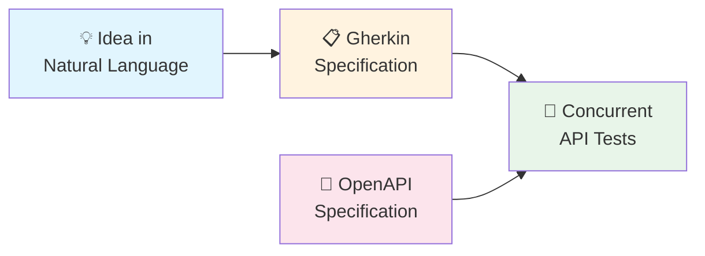
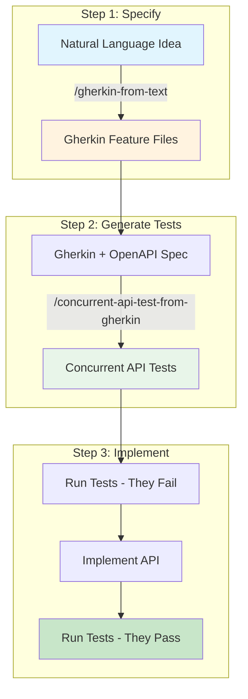
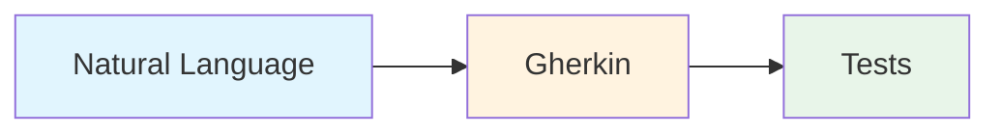
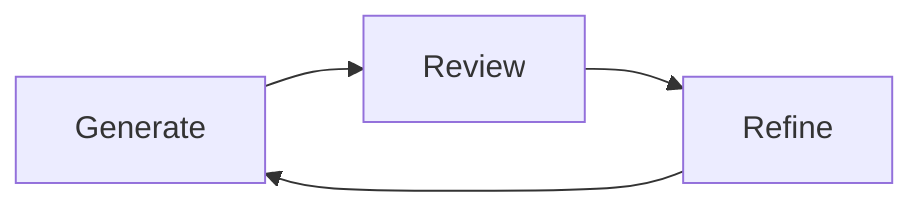

# Writing Concurrent API Tests with AI Agents

This guide describes how to work with AI agents to build production systems through an incremental, evolutive process. The approach separates *what* and *why* from *how* by using Gherkin as a specification format, transforming natural language ideas into formal specifications, then into verifiable concurrent API tests.



### Prerequisites

**This guide builds on top of [Concurrent API Testing](concurrent-api-testing-guide.md).** You should read that guide first to understand:
- Why concurrent testing matters
- How data partitioning enables test isolation
- The Arrange-Act-Assert pattern
- Templates and fixtures

This guide extends those concepts by adding AI-assisted test writing to the workflow.

---

## Maturity Status

> ⚠️ **Important Distinction**
> 
> | Component | Maturity |
> |-----------|----------|
> | **Concurrent API Tests** | ✅ **Production-ready** — Battle-tested across multiple projects with many contributors, handling 1500+ API tests |
> | **AI-Assisted Test Writing** | 🧪 **Experimental** — Promising results in small-scale experiments (~10 tests), but not yet validated at scale (200+ tests) or in team environments |
>
> **Next validation steps:**
> - Apply the approach to a 200+ test project
> - Validate with multiple team members collaborating
> - Refine prompts based on real-world friction points

---

## What Problem Does This Solve?

**The challenge:** How do we work with AI agents to build production systems?

The process must be:
- **Incremental and evolutive** — Build and refine over time
- **Production-ready** — Generate systems deployable with confidence  
- **Team-oriented** — Work with software engineering teams, not just solo developers

**The software development lifecycle starts with understanding:**
- **What** the system should do
- **Why** it matters
- Not **how** to implement it

**The solution:** Separate what/why from how using specialized prompts:

1. **Natural language → Gherkin** — Formalize the what and why in structured specifications
2. **Gherkin → Tests** — Verify conformance through automated concurrent API tests

This approach works because:
- Gherkin captures *what* and *why*, not implementation details
- Concurrent API tests verify the system matches the specification
- Together, they turn ideas into verifiable specifications

---

## Why Gherkin as an Intermediate Step?

[Gherkin](https://cucumber.io/docs/gherkin/) is a structured language for describing software behavior. Using it as an intermediate step provides several benefits:

| Benefit | Description |
|---------|-------------|
| **Forces declarative thinking** | You describe *what* the system does, not implementation details |
| **Applies the minimalistic principle early** | Each example includes only essential details |
| **Creates reviewable specifications** | You can validate requirements before generating tests |
| **Preserves business context** | Rules and rationale are captured, not just test cases |

📚 **Learn more:** [Cucumber BDD Documentation](https://cucumber.io/docs/bdd/)

---

## Prompt 1: `/gherkin-from-text`

**Purpose:** Transform natural language ideas into formal Gherkin specifications.

**What it does:**
- Converts loose descriptions into structured Feature files
- Applies the Minimalistic Principle — only essential details in each example
- Ensures declarative style (behavior, not implementation)
- Separates functional requirements from UX-specific details
- Asks clarifying questions when requirements are ambiguous

**What it produces:** One `.feature` file per feature, containing business rules and examples.

## Prompt 2: `/concurrent-api-test-from-gherkin`

**Purpose:** Generate concurrent API tests from Gherkin specifications.

**What it does:**
- Analyzes Gherkin features and OpenAPI specifications together
- Generates test files following the concurrent testing patterns
- Applies data partitioning strategies from the OpenAPI spec
- Creates templates, fixtures, and test files
- Ensures tests are isolated and can run concurrently
- Asks questions when partitioning strategy is unclear

**What it produces:** Test files (`*.apiTest.ts`, `*.fixture.ts`, `*.template.ts`) that verify the API behavior matches the Gherkin specification.

---

## The Process



### This is Highly Incremental

**Don't expect magic.** Working with AI agents is collaborative:

- **Challenge the agent** — Question generated Gherkin when rules seem incomplete
- **Be challenged by the agent** — The prompts instruct agents to ask clarifying questions
- **Make corrections** — Edit generated output when needed
- **Write some parts yourself** — AI assists, it doesn't replace your expertise

### This is Highly Flexible

You can work on specifications and tests in whatever order makes sense:

- Write Gherkin for one feature, then immediately write its tests
- Write Gherkin for many features, then write tests later
- Mix and match based on what you're exploring

### Always Flow Forward



**Recommended:** Always flow from natural language → Gherkin → tests.

**Not recommended:** Going backward from tests → Gherkin → natural language. While technically possible, it loses the business context that makes Gherkin valuable.

**Why?** Tests only document *examples*, not *rules*. Gherkin captures the *why*, the business context, and the general rules — not just specific test cases. When you discover missing specifications while writing tests or implementing the system, go back and update the Gherkin first.

### Aim for Complete Specifications

Gherkin should be more than test input. A well-written specification includes:

- **Business context** — Why does this feature exist?
- **Value proposition** — What problem does it solve?
- **Decision links** — References to ADRs or design documents
- **Business rules** — General rules, not just examples
- **Examples** — Concrete illustrations of the rules

---

## Complete Flow Example

Let's walk through the entire process using a simplified blog post system. This example uses a subset of the blog system from the [Concurrent API Testing Guide](concurrent-api-testing-guide.md) to minimize cognitive load.

**What we'll build:** Blog post creation with title validation and keyword search.

**Reference:** The OpenAPI specification for this example is available at [example-blog-post-openapi.yaml](example-blog-post-openapi.yaml). It defines the data partitioning strategy for each endpoint, which the test generation prompt uses to ensure proper isolation.

---

### Step 1: Start with a Natural Language Idea

You have a feature in mind. Write it down in plain language. Include business context, why it matters, and the rules:

```
Blog Post Creation

Blog posts are the core content of our platform. Users create posts to share 
articles, tutorials, and ideas with readers.

Why this matters:
- Content creators need to publish their work
- Readers need to discover content through search
- We need to maintain content quality

Title requirements:
Every blog post must have a title. Titles appear in search results and listings,
so they're essential for discoverability. The title cannot be null or empty.

Keywords:
Keywords are optional but enable search. A post can have multiple keywords.
Users should be able to search for posts by keyword and get matching results.

Examples:
- User creates "Getting Started with Gherkin" with keywords ["testing", "automation"] → works
- User tries to create a post without a title → rejected
- User searches for "testing" → finds all posts with that keyword
```

---

### Step 2: Generate Gherkin with `/gherkin-from-text`

**User prompt to AI agent:**

```
/gherkin-from-text

Blog Post Creation

Blog posts are the core content of our platform. Users create posts to share 
articles, tutorials, and ideas with readers.

Why this matters:
- Content creators need to publish their work
- Readers need to discover content through search
- We need to maintain content quality

Title requirements:
Every blog post must have a title. Titles appear in search results and listings,
so they're essential for discoverability. The title cannot be null or empty.

Keywords:
Keywords are optional but enable search. A post can have multiple keywords.
Users should be able to search for posts by keyword and get matching results.

Examples:
- User creates "Getting Started with Gherkin" with keywords ["testing", "automation"] → works
- User tries to create a post without a title → rejected
- User searches for "testing" → finds all posts with that keyword
```

**Agent output:** `blog-post.feature`

```gherkin
Feature: Blog Post Creation

  Blog posts are the core content of our platform. Users create posts
  to share articles, tutorials, and ideas with readers.
  
  Why this matters:
  - Content creators need to publish their work
  - Readers need to discover content through search
  - We need to maintain content quality

  Rule: A blog post must have a title
  
    Titles appear in search results and listings, so they're essential 
    for discoverability.

    Example: Create a blog post with a title
      When a user creates a blog post with title "Getting Started with Gherkin"
      Then the blog post is created with title "Getting Started with Gherkin"

    Example: Title is required
      When a user creates a blog post without a title
      Then the creation fails with error "Title is required"

    Example: Title cannot be empty
      When a user creates a blog post with an empty title
      Then the creation fails with error "Title is required"

  Rule: Keywords enable content discovery

    Example: Create a blog post with keywords
      When a user creates a blog post with keywords "testing" and "automation"
      Then the blog post is created with keywords "testing" and "automation"

    Example: Search blog posts by keyword
      Given blog posts exist with keyword "testing"
      When a user searches for posts with keyword "testing"
      Then posts with keyword "testing" are returned
```

**Note:** The agent might ask clarifying questions before generating this output. For example:
- "Should empty string and null title be treated the same way?"
- "What happens when no posts match the search keyword?"

Answer these questions to refine the specification.

---

### Step 3: Review and Refine the Gherkin

Read the generated Gherkin critically:

- Does it capture all the business rules?
- Are the examples clear and minimalistic?
- Is anything missing or ambiguous?

In this case, the specification looks good. The agent:
- Added business context in the Feature description
- Grouped examples under Rules
- Applied the Minimalistic Principle (no irrelevant details)
- Covered both success and error cases

---

### Step 4: Generate Tests with `/concurrent-api-test-from-gherkin`

Now we transform the Gherkin into executable tests. The agent needs both the Gherkin and the [OpenAPI specification](example-blog-post-openapi.yaml).

**User prompt to AI agent:**

```
/concurrent-api-test-from-gherkin

Generate concurrent API tests for the blog post feature.

Gherkin: gherkins/blog-post/blog-post.feature
OpenAPI: docs/example-blog-post-openapi.yaml
```

**Agent output:** Three files in `test/blogPost/`

---

**`blogPost.template.ts`**

```typescript
import { defineCopyTemplate } from "@villedemontreal/concurrent-api-tests";
import { BlogPostRequest } from "../shared/apiUnderTest/generated/api";

export const copyBlogPostTemplate = defineCopyTemplate<BlogPostRequest>({
  title: "titleDefault",
  content: "contentDefault",
  keywords: [],
});
```

---

**`blogPost.fixture.ts`**

```typescript
import {
  postBlogPost as postBlogPostApi,
  getBlogPosts as getBlogPostsApi,
  BlogPostRequest,
  BlogPostResponse,
} from "../shared/apiUnderTest/generated/api";

export async function postBlogPost(request: BlogPostRequest): Promise<BlogPostResponse> {
  const response = await postBlogPostApi(request);
  return response.body;
}

export async function getBlogPosts(keyword: string): Promise<BlogPostResponse[]> {
  const response = await getBlogPostsApi({ keyword });
  return response.body;
}
```

---

**`blogPost.apiTest.ts`**

```typescript
import { shouldThrow, getTestRunId } from "@villedemontreal/concurrent-api-tests";
import { assert } from "chai";
import { postBlogPost, getBlogPosts } from "./blogPost.fixture";
import { copyBlogPostTemplate } from "./blogPost.template";

export function blogPostApiTests() {
  describe("Blog Post Creation", () => {
    
    describe("A blog post must have a title", () => {
      
      it("Create a blog post with a title", async () => {
        const request = copyBlogPostTemplate((x) => {
          x.title = "Getting Started with Gherkin";
        });

        const actual = await postBlogPost(request);

        assert.strictEqual(actual.title, "Getting Started with Gherkin");
      });

      it("Title is required", async () => {
        const request = copyBlogPostTemplate((x) => {
          x.title = null as any;
        });

        await shouldThrow(
          () => postBlogPost(request),
          (err) => {
            assert.strictEqual(err.status, 400);
            assert.include(err.data.message, "Title is required");
          }
        );
      });

      it("Title cannot be empty", async () => {
        const request = copyBlogPostTemplate((x) => {
          x.title = "";
        });

        await shouldThrow(
          () => postBlogPost(request),
          (err) => {
            assert.strictEqual(err.status, 400);
            assert.include(err.data.message, "Title is required");
          }
        );
      });
    });

    describe("Keywords enable content discovery", () => {
      
      it("Create a blog post with keywords", async () => {
        const request = copyBlogPostTemplate((x) => {
          x.title = "Test Post";
          x.keywords = ["testing", "automation"];
        });

        const actual = await postBlogPost(request);

        assert.deepEqual(actual.keywords, ["testing", "automation"]);
      });

      it("Search blog posts by keyword", async () => {
        const keyword = `${getTestRunId()}-testing`;

        await Promise.all([
          postBlogPost(copyBlogPostTemplate((x) => {
            x.title = "First Post";
            x.keywords = [keyword];
          })),
          postBlogPost(copyBlogPostTemplate((x) => {
            x.title = "Second Post";
            x.keywords = [keyword];
          })),
        ]);

        const actual = await getBlogPosts(keyword);

        assert.strictEqual(actual.length, 2);
        assert.include(actual.map((x) => x.title), "First Post");
        assert.include(actual.map((x) => x.title), "Second Post");
      });
    });
  });
}
```

---

### Step 5: Review the Generated Tests

Verify that the tests:

1. **Map correctly to Gherkin** — Each `Example` becomes an `it()`, each `Rule` becomes a `describe()`
2. **Apply data partitioning** — The search test uses `getTestRunId()` for the client-controlled keyword field
3. **Follow the Minimalistic Principle** — Only meaningful attributes are set and asserted
4. **Use explicit expected values** — `"Getting Started with Gherkin"`, not `request.title`

---

### Step 6: Run the Tests

```bash
npm test
```

The tests will fail because the API doesn't exist yet. This is expected — **you now have executable specifications** that define what the system should do.

---

### Step 7: Implement the API

Implement the API endpoints to make the tests pass. The tests serve as your acceptance criteria.

---

## When You Discover Missing Specifications

While writing tests or implementing the system, you'll often discover gaps:

- "What happens if the title is exactly 200 characters?"
- "Should search be case-sensitive?"
- "What if a keyword contains special characters?"

**The right approach is to restart the complete flow:**

1. **Update the Gherkin using `/gherkin-from-text`** — Provide the natural language input describing what's missing, and the agent will regenerate/update the Gherkin specifications
2. **Regenerate/update the tests using `/concurrent-api-test-from-gherkin`** — Use the updated Gherkin, mention the changes and that test needs added/updated
3. **Implement the behavior** — Make the new test pass

**The complete flow is highly flexible:** You can use this workflow for an entirely new feature or just to add missing details to an existing feature. It works equally well for small changes (adding one edge case) as it does for large changes (adding multiple new rules). The process remains the same regardless of scope.

This keeps your specifications complete and your tests aligned with documented behavior.

---

## Working Effectively with the Agents

### Answer Agent Questions Thoughtfully

The prompts instruct agents to ask questions when:
- Requirements are ambiguous
- Data partitioning is unclear
- Business rules seem incomplete

Take these questions seriously — they often reveal gaps in your thinking.

### Review and Edit Output

AI-generated output is a starting point, not a final product:
- Read every generated example
- Check that business rules are complete
- Edit wording for clarity
- Add missing edge cases

### Iterate

Expect multiple rounds:



Each iteration improves the specification and tests.

---

## Potential Extensions

This approach has potential to extend beyond test writing:

| Extension | Description |
|-----------|-------------|
| **Analyst/tester tooling** | Adapt prompts so non-developers can use them directly |
| **Stakeholder collaboration** | Tools for all stakeholders to read and comment on Gherkin specs |
| **PRD generation** | Generate Product Requirements Document (PRD) files from all Gherkin specs to provide an overall summary of the system that each stakeholder can easily read |
| **Exploratory UI testing** | Use Gherkin specs with AI agents and Playwright MCP for exploratory testing |
| **UI smoke tests** | Generate basic UI tests from Gherkin (more complex than API tests) |
| **Full development pipeline** | Use Gherkin specs as input for API design, system design, database design, and implementation — extending this approach to the entire software development lifecycle |

---

## Summary

This guide describes how to work with AI agents to build production systems through an incremental, evolutive process:

1. **Formalize what and why in Gherkin** — Use `/gherkin-from-text` to transform natural language into structured specifications
2. **Verify conformance through tests** — Use `/concurrent-api-test-from-gherkin` to produce properly isolated concurrent tests
3. **Review and refine** — AI assists but doesn't replace your judgment

The result:
- Ideas become verifiable specifications
- Systems are deployable with confidence
- Process works for teams, not just individuals

**Start small.** Try the workflow on one feature. Refine your approach. Build confidence. Then scale.

---

## References

- [Concurrent API Testing Guide](concurrent-api-testing-guide.md) — Foundation for the testing approach
- [Cucumber BDD Documentation](https://cucumber.io/docs/bdd/) — Gherkin and BDD best practices
- [Example OpenAPI Specification](example-blog-post-openapi.yaml) — API spec used in this guide's examples
